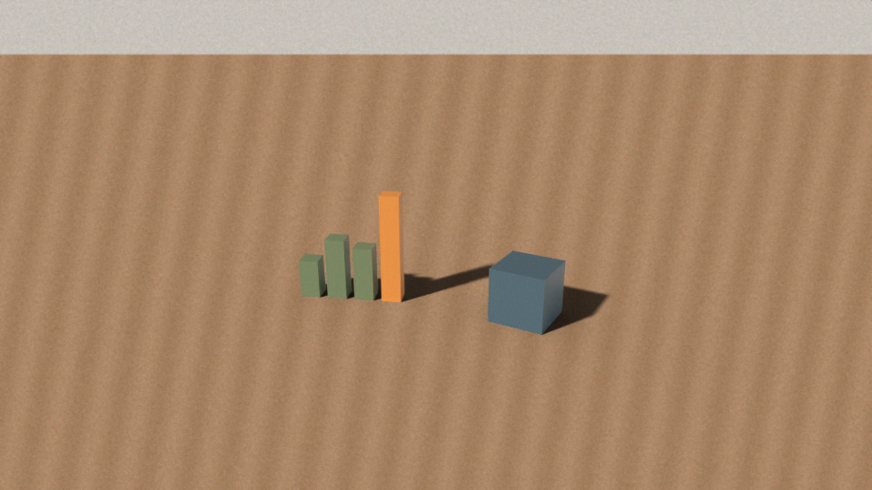

# 3D Models Compositing for Claude

A Claude skill for inserting simple 3D elements (cubes, bar charts, spheres,
panels) into real photos and videos so they look physically present: matched
to the real camera's orientation, lit from the room's own light direction, and
casting **real** shadows onto the real surface via a Blender shadow catcher.



## Layout

- `ar-3d-compositing/` — the skill itself (drop this folder into Claude's skills)
  - `SKILL.md` — workflow Claude follows
  - `scripts/render_blender.py` — headless Blender renderer driven by a JSON scene spec
  - `scripts/composite_plate.py` — overlays the render on the photo/video plate
  - `scripts/sample_palette.py` — derives object/light colors from the footage
  - `scripts/estimate_orientation.py` — recovers camera orientation from parallel lines (`--blender` output)
  - `references/talking-head.md` — presenter/gesture videos, green screen, beat mapping
- `examples/` — a sample scene spec and its render

## Quick start

```bash
uv venv -p 3.13 bpyenv && . bpyenv/bin/activate && uv pip install bpy pillow numpy
python ar-3d-compositing/scripts/render_blender.py examples/desk-scene.json --out out/still --frames 40 40 --no-webm
deactivate
python3 ar-3d-compositing/scripts/composite_plate.py plate.jpg out/still/frame_0040.png --out test.png
```

## Design rules

- No house style: colors and light direction are required in every scene spec
  and should come from the footage.
- Real shadows only — no painted contact shadows.
- Fixed cameras only (tripod, propped phone, webcam, still photo). Moving
  cameras need a per-frame camera solve first (future work).
