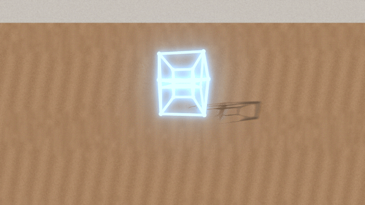

# 3D Models Compositing for Claude

A Claude skill for inserting simple 3D elements (cubes, bar charts, spheres,
panels) into real photos and videos so they look physically present: matched
to the real camera's orientation, lit from the room's own light direction, and
casting **real** shadows onto the real surface via a Blender shadow catcher.



## Layout

- `ar-3d-compositing/` — the skill itself (drop this folder into Claude's skills)
  - `SKILL.md` — workflow Claude follows
  - `scripts/render_blender.py` — headless Blender renderer driven by a JSON scene spec
  - `scripts/composite_plate.py` — overlays the render on the photo/video plate
  - `scripts/add_glow.py` — 2D bloom pass for emissive/neon objects
  - `scripts/lightning_fx.py` — procedural force-lightning asset (transparent loop: PNGs, alpha .webm, ProRes 4444 .mov)
  - `scripts/sample_palette.py` — derives object/light colors from the footage
  - `scripts/estimate_orientation.py` — recovers camera orientation from parallel lines (`--blender` output)
  - `references/talking-head.md` — presenter/gesture videos, green screen, beat mapping
- `examples/` — sample scene specs and the README render (`desk-tesseract-scene.json` → `desk-tesseract.gif`) and a fingertip lightning asset (`force-lightning.webm`, preview `force-lightning-preview.gif`)

## Quick start

```bash
uv venv -p 3.13 bpyenv && . bpyenv/bin/activate && uv pip install bpy pillow numpy
python ar-3d-compositing/scripts/render_blender.py examples/desk-scene.json --out out/still --frames 40 40 --no-webm
deactivate
python3 ar-3d-compositing/scripts/composite_plate.py plate.jpg out/still/frame_0040.png --out test.png
```

## Design rules

- No house style: colors and light direction are required in every scene spec
  and should come from the footage.
- Real shadows only — no painted contact shadows.
- Fixed cameras only (tripod, propped phone, webcam, still photo). Moving
  cameras need a per-frame camera solve first (future work).

## License

The code, scripts, skill instructions, and scene-spec files in this repository
are released under the [MIT License](LICENSE).

**Images, GIFs, and videos are not covered by the MIT License.** This includes
everything in `examples/` such as `desk-tesseract.gif`,
`force-lightning-preview.gif`, and `force-lightning.webm`, plus any photos or
footage shown in this README. These are © 2026 Hayden Harms, all rights
reserved. You may not copy, redistribute, modify, or reuse them without
written permission. Running the scripts on your own footage and using your own
output is fine.
